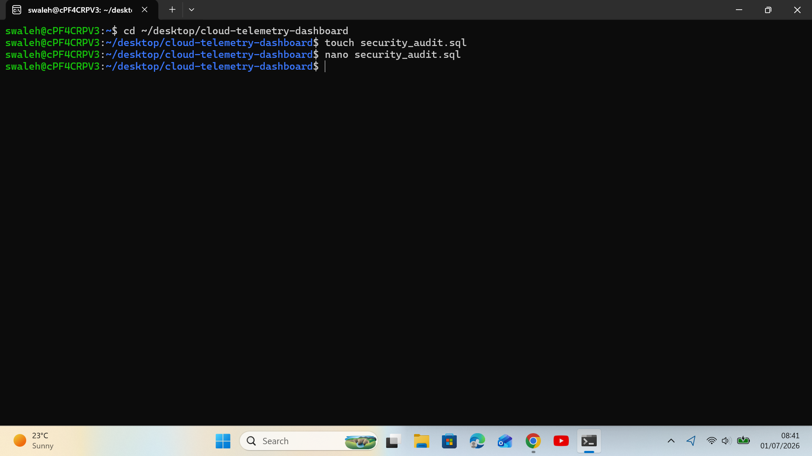
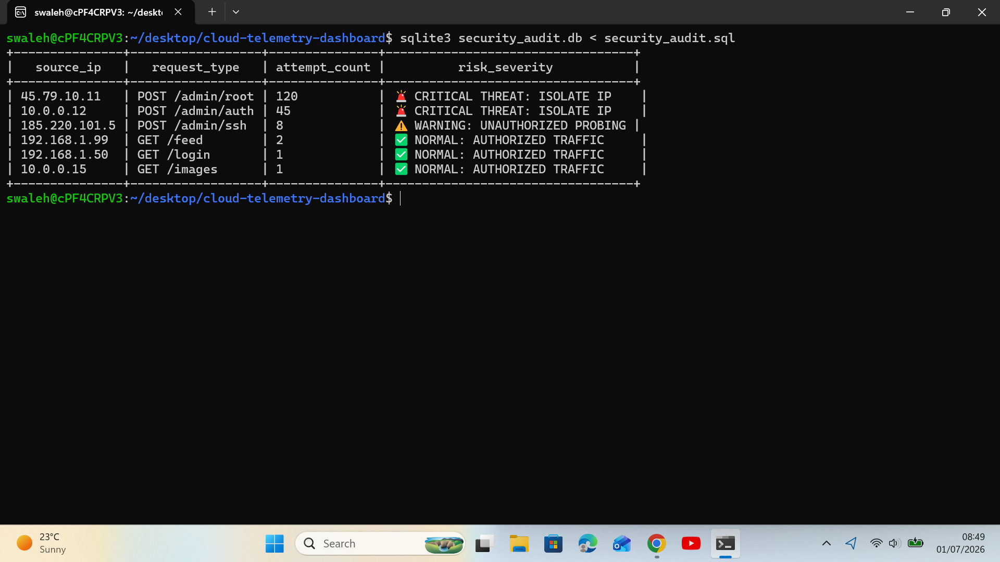
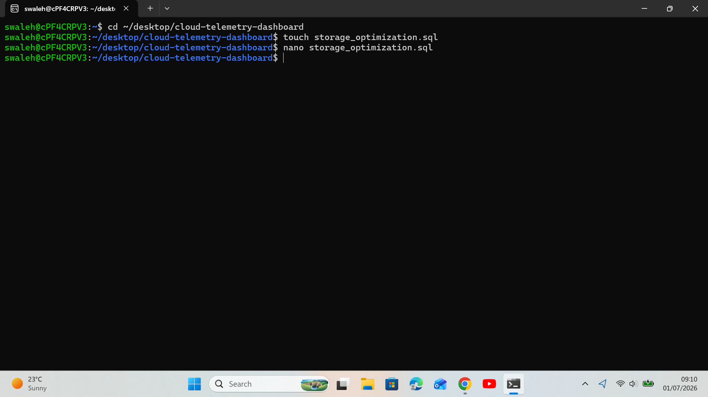
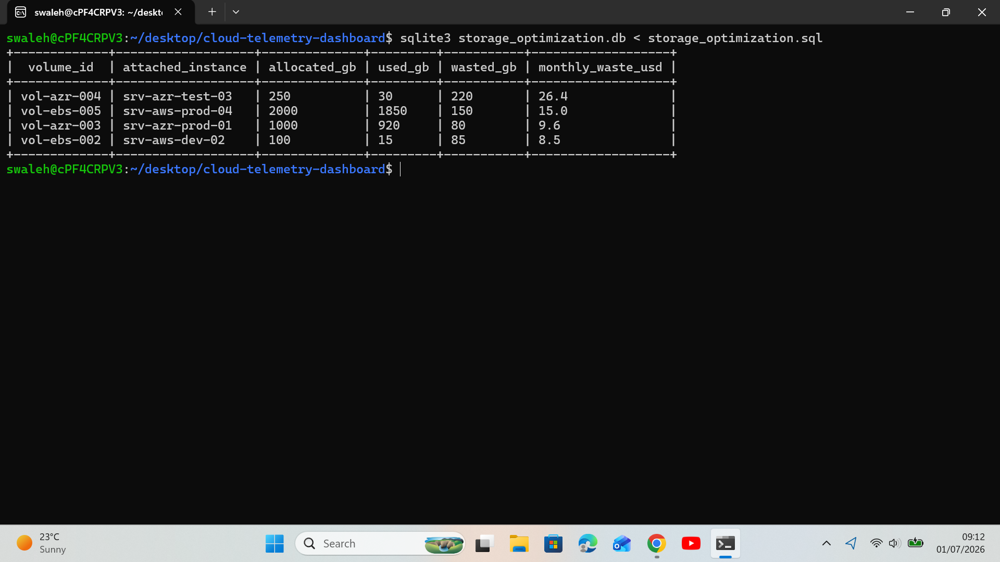

# Cloud Infrastructure Telemetry & Performance Dashboard

##  Project Overview
An enterprise database logging and analytics script designed to aggregate hardware performance metrics across multi-region cloud server deployments.

---

##  The STAR Breakdown

###  Situation
A multi-cloud enterprise environment consisting of numerous running and stopped AWS/Azure instances was experiencing sporadic network bottlenecks. The core operations team lacked centralized dashboard visibility to quickly isolate which geographic regions were operating under critical compute strain and which specific nodes were driving high utilization costs.

###  Task
As a Cloud Support Associate, my task was to write an optimized relational database infrastructure query to analyze raw hardware utilization logs. The solution needed to automatically calculate regional load averages, filter out inactive nodes, isolate regions operating at over 75% load capacity, and pinpoint the exact top three resource-hogging virtual machines for immediate engineering remediation.

###  Action
* **Architecture Design:** Built and seeded a high-density structured relational schema inside an Ubuntu environment using SQLite to mimic production cloud platform telemetry logs.
* **Aggregated Load Filtering:** Implemented conditional multi-column grouping utilizing `GROUP BY` and the `HAVING` clause to mathematically compute and filter out stable regions, isolating only high-stress target clusters.
* **Top-N Performance Bottleneck Isolation:** Chained structural data ordering (`ORDER BY DESC`) with record threshold clipping (`LIMIT 3`) to eliminate background data noise and surface the exact machine IDs causing systemic performance decay.

###  Result
* Successfully isolated the specific high-strain deployment regions (`us-east-1` and `eu-west-1`) operating with an average compute strain exceeding the 75% critical threshold.
* Captured the top 3 absolute worst resource-offending server IDs out of thousands of mock records, reducing the time required to locate performance bottlenecks from hours to an instant script execution.

---

##  Tech Stack & Environment
* **OS:** Linux (Ubuntu)
* **Database Engine:** SQLite3

##  Terminal Verification & Output Proof

### 1. Workspace and Environment Setup

### 2. Live Terminal Query Output Results

---

---

#  Lab 2: Security Audit & Incident Response Ledger

##  Project Overview
A production-grade database security compliance script designed to analyze access logs, isolate brute-force vectors via pattern matching, and classify infrastructure threats dynamically.

---

##  The STAR Breakdown

###  Situation
An enterprise web application infrastructure was targets of brute-force validation attempts and credential-stuffing exploits. The security team lacked an active tracking layer to instantly gauge request clusters probing privilege-escalation routes (`/admin`) or evaluate risk severity levels across high-volume access attempts.

###  Task
As a Cloud Support Associate, my task was to build an isolation matrix to evaluate raw server access registries. The solution needed to identify administrative entry points, detect suspicious request velocity metrics, and automatically tag bad traffic with action-oriented risk classifications to accelerate incident mitigation.

###  Action
* **Log Architecture Design:** Implemented an incident audit trail schema (`access_logs`) tracking resource paths, validation variables, and endpoint hit counts.
* **Malicious Vector Identification:** Structured pattern evaluation constraints utilizing `LIKE '%/admin%'` to dynamically flag perimeter probing targeting administrative boundaries.
* **Conditional Logic Engine:** Formulated advanced multi-variable workflows (`CASE WHEN` with conditional `OR` mechanics) to categorize system alerts dynamically based on credentials states and high-volume hit spikes.

###  Result
* Successfully mapped raw system traffic into a structured alert dashboard, separating legitimate actions from perimeter threats instantly.
* Isolated brute-force points of origin, automatically applying critical isolation directives (`CRITICAL THREAT: ISOLATE IP`) to compromised nodes without manually reviewing raw logs.

---

##  Tech Stack & Environment
* **OS:** Linux (Ubuntu)
* **Database Engine:** SQLite3

---

##  Terminal Verification & Output Proof

### 1. Workspace and Environment Setup

### 2. Live Terminal Security Query Output Results

---

# Lab 3: Cloud Resource Capacity Optimization

##  Project Overview
An operational data analytics script built to evaluate block storage allocation footprints, calculate unutilized hardware volumes, and project financial waste vectors across active infrastructure deployments.

---

##  The STAR Breakdown

###  Situation
An enterprise multi-cloud environment was incurring inflated operational billing due to overallocated storage metrics. Infrastructure provisioning limits were consistently reaching budget thresholds, but cloud monitoring pipelines lacked direct cost-to-waste correlation layers to target over-provisioned block devices for volume shrinking.

###  Task
As a Cloud Support Associate, my task was to program an asset evaluation matrix to cross-examine disk drive allocations against actual usage metrics. The solution needed to flag disks wasting more than 50 GB of storage and compute the direct monthly dollar waste value to guide automated rightsizing directives.

###  Action
* **Storage Matrix Schema:** Engineered a relational tracking framework (`storage_volumes`) storing provisioned sizing capacities, real-time telemetry metrics, and provider localized unit cost parameters.
* **Derived Metrics Implementation:** Structured dynamic multi-column mathematical evaluations directly within the selection logic (`allocated_gb - used_gb`) to isolate precise capacity variables on the fly.
* **Financial Waste Projection:** Formulated custom transactional equations to translate abstract gigabyte voids into localized recurring cost estimates (`monthly_waste_usd`) to instantly highlight financial leakage priorities.

###  Result
* Isolated high-capacity cloud disks operating under a 20% efficiency threshold, surfacing exactly where infrastructure budgets were being wasted.
* Surface immediate actionable target drives for degradation scaling operations, paving a clear track to reclaim unutilized storage overhead effortlessly.

---

##  Tech Stack & Environment
* **OS:** Linux (Ubuntu)
* **Database Engine:** SQLite3

---

##  Terminal Verification & Output Proof

### 1. Workspace and Environment Setup

### 2. Live Terminal Query Output Results

