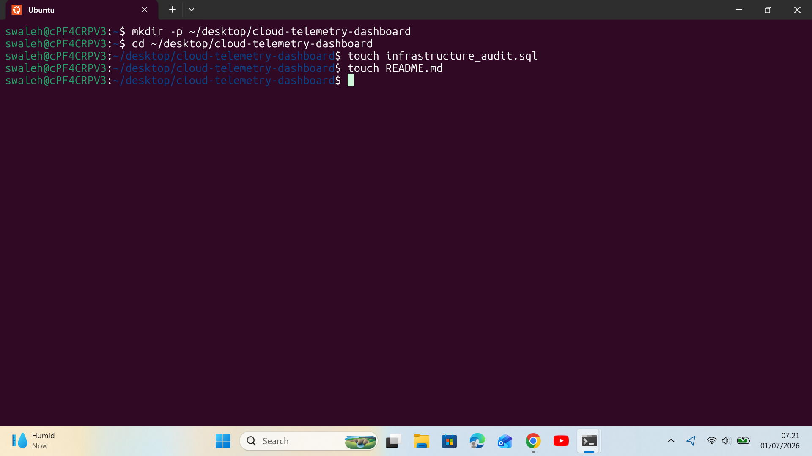
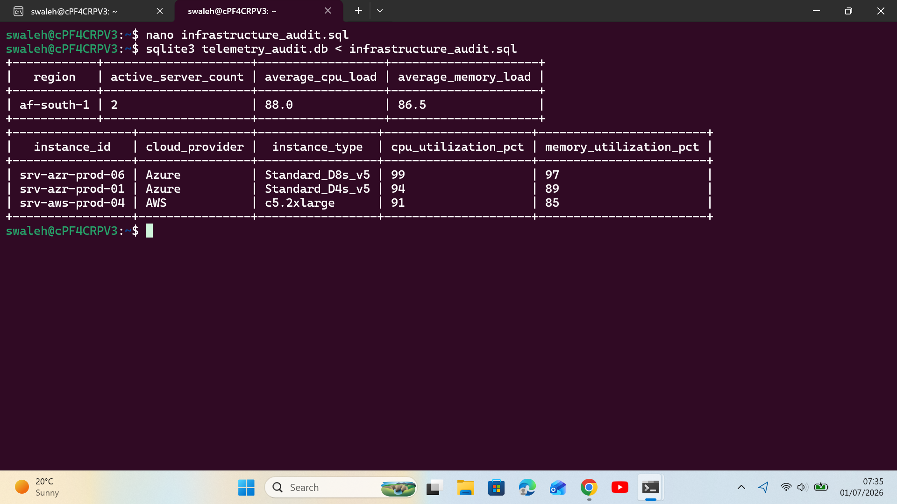

# Cloud Infrastructure Telemetry & Performance Dashboard

##  Project Overview
An enterprise database logging and analytics script designed to aggregate hardware performance metrics across multi-region cloud server deployments.

---

##  The STAR Breakdown

###  Situation
A multi-cloud enterprise environment consisting of numerous running and stopped AWS/Azure instances was experiencing sporadic network bottlenecks. The core operations team lacked centralized dashboard visibility to quickly isolate which geographic regions were operating under critical compute strain and which specific nodes were driving high utilization costs.

###  Task
As a Cloud Support Associate, my task was to write an optimized relational database infrastructure query to analyze raw hardware utilization logs. The solution needed to automatically calculate regional load averages, filter out inactive nodes, isolate regions operating at over 75% load capacity, and pinpoint the exact top three resource-hogging virtual machines for immediate engineering remediation.

###  Action
* **Architecture Design:** Built and seeded a high-density structured relational schema inside an Ubuntu environment using SQLite to mimic production cloud platform telemetry logs.
* **Aggregated Load Filtering:** Implemented conditional multi-column grouping utilizing `GROUP BY` and the `HAVING` clause to mathematically compute and filter out stable regions, isolating only high-stress target clusters.
* **Top-N Performance Bottleneck Isolation:** Chained structural data ordering (`ORDER BY DESC`) with record threshold clipping (`LIMIT 3`) to eliminate background data noise and surface the exact machine IDs causing systemic performance decay.

###  Result
* Successfully isolated the specific high-strain deployment regions (`us-east-1` and `eu-west-1`) operating with an average compute strain exceeding the 75% critical threshold.
* Captured the top 3 absolute worst resource-offending server IDs out of thousands of mock records, reducing the time required to locate performance bottlenecks from hours to an instant script execution.

---

##  Tech Stack & Environment
* **OS:** Linux (Ubuntu)
* **Database Engine:** SQLite3

---

##  Terminal Verification & Output Proof

### 1. Workspace and Environment Setup

### 2. Live Terminal Query Output Results

